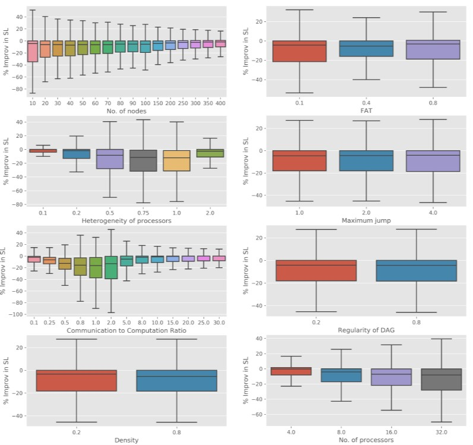
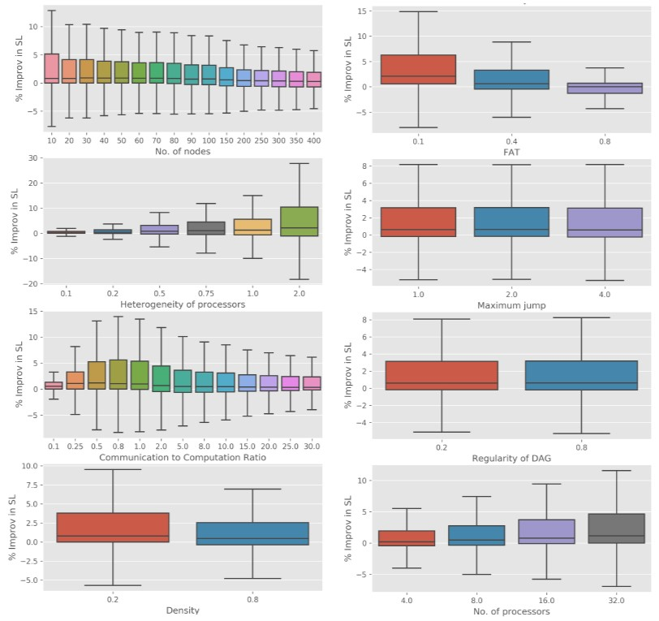

# Task Scheduling using DAGs
This repository implements three different algorithms for static list scheduling of [Directed Acyclic Graphs](https://en.wikipedia.org/wiki/Directed_acyclic_graph) (DAGs). The primary objective of task scheduling is to assign tasks to the available processors and define the order of the execution of tasks to minimize the overall completion time. Both the tasks as well as the available processors may be heterogenous. The preemptive scheduling problem is a well known NP complete problem and the heterogeneity of processors only adds another layer of complexity to finding the optimal solution. Static scheduling makes the assumption that information such as the execution and communication times between tasks in known beforehand.

The following algorithms have been implemented in this repository:
1. **Heterogenous Earliest FInish Time** ([HEFT](https://en.wikipedia.org/wiki/Heterogeneous_Earliest_Finish_Time)): A well known DAG scheduling algorithm developed by H. Topcuoglu , M. Wu, et al. (2002) in [this paper](https://citeseerx.ist.psu.edu/viewdoc/summary?doi=10.1.1.119.122)
2. **RandomHEFT**: This algorithm is proposed by S. AlEbrahim and I. Ahmad (2017) in [this paper](https://link.springer.com/article/10.1007/s11227-016-1917-2). They do not name the algorithm as RandomHEFT, however, I use this name to refer to the algorithm proposed by them because of the key additions done to the vanilla HEFT algorithm.
3. **Improved Predict Earliest Finish Time** (IPEFT): This algorithm is proposed by N.Zhou et al. (2017) in [this paper](https://onlinelibrary.wiley.com/doi/abs/10.1002/cpe.3944) as an improvement to the commonly used PEFT algorithm.

The work in this repository was done to primarily compare the performance of the three different algorithms.

## Running the Code
Constructing new example DAGs requires the [DAGGEN](https://github.com/frs69wq/daggen) github repository. The code assumes that `daggen.c` is inside folder `/daggen-master/`. 

Required python packages: pandas, numpy and multiprocessing.

To run the HEFT algorithm, provide the DAG definition as a `.dot` file:
`$ python heft.py -i test.dot`
For randomHEFT:
`$ python randomHEFT.py -i test.dot`
For IPEFT:
`$ python ipeft.py -i test.dot`

## File Descriptions
1. `generate_dags.py`: Used to generate new DAGs using DAGGEN with different parameters. The no. of tasks (n), FAT, density, regularity and jump can be set inside this file. All generated DAGs are saved inside the /dag folder with name convention: n_fat_density_regularity_jump.dot
2. `heft.py`: HEFT Scheduler
3. `ipeft.py`: IPEFT Scheduler
4. `randomHEFT.py`: randomHEFT Scheduler
5. `read_dag.py`: Parser of dot file generated by DAGGEN. Takes `.dot` file and outputs an array `[no. of tasks, no. of processors, communication matrix, adjacency matrix]`. Also accepts parameters of CCR, p and beta (heterogeneity of processors)
6. `main_parallel.py`: Main program that runs threads (equal to the number of cores on PC) where each thread solves a single .dot DAG file with the three algorithms for various values of CCR, p and beta. Saves the results into a pickle file called 'data.pkl' every 57 DAGs.
7. `Result Visualization.ipynb`: Jupyter notebook which provides some results on the performance of the three algorithm for different types of DAGs.
8. `Report.pdf`: Contains a well documented report on the comparison of the three different algorithms.

## Comparison Results
Below are some results showing the percentage improvement in Total Schedule Length when using the randomHEFT algorithm over the HEFT algorithm.

Finally, below is the same percentage improvement for the IPEFT algorithm over the HEFT algorithm.
